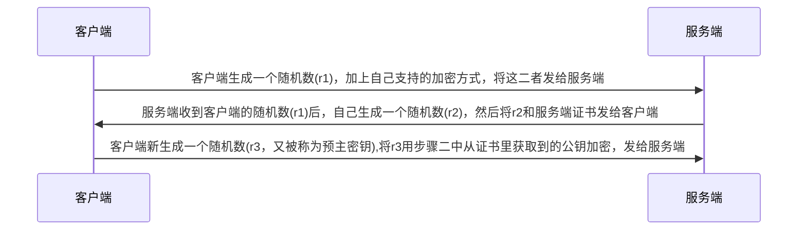

```mermaid
sequenceDiagram
  客户端 ->>  服务端 : 客户端生成一个随机数(r1)，加上自己支持的加密方式，将这二者发给服务端
  服务端 ->> 客户端: 服务端收到客户端的随机数(r1)后，自己生成一个随机数(r2)，然后将r2和服务端证书发给客户端
  客户端 ->> 服务端: 客户端新生成一个随机数(r3，又被称为预主密钥),将r3用步骤二中从证书里获取到的公钥加密，发给服务端
```
之后，服务端就可以用私钥解出r3。服务端和客户端都可以用商量好的加密方式，通过加密(r1, r2, r3)得到会话密钥。